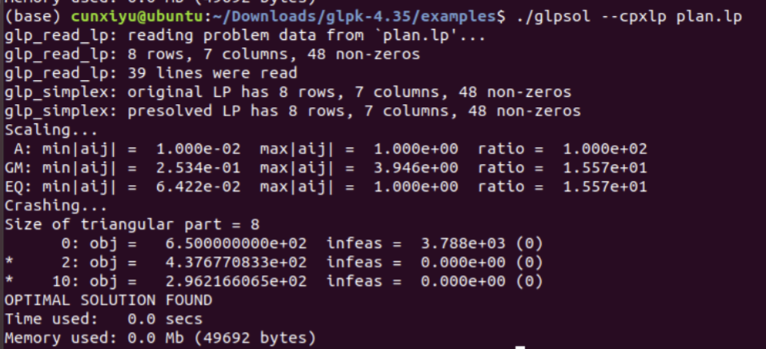

# Automated-ILP-Scheduler

Takes an edgelist graph represented from a DFG and automatically generates the schedule using ILP solver GLPK and produces the Quality-of-Results. Supports ML-RC, MR-LC, or both using Pareto-optimal analysis.

## Documentation

### Setup 

* Use a Linux distribution

* Install Git and clone this repo:

`sudo apt update; sudo apt install git`

`git clone https://github.com/ElmirDzaka/Automated-ILP-Scheduler.git`

* Install Python and the library 'networkx' and 'tabulate':

`sudo apt install python3`

`pip install networkx`

`pip install tabulate`

* Install GLPK **(in the same directory as this repo)**

    * Download GLPK source and unzip the file:
    
    `wget http://ftp.gnu.org/gnu/glpk/glpk-4.35.tar.gz; tar -zxvf glpk-4.35.tar.gz`
    
    * Install libraries for compilation:
    
    `sudo apt-get install build-essential`
    
    * Enter the unzipped folder and prepare for compilation:
    
    `cd glpk-4.35; ./configure`
    
    * Compile and install GLPK to your system:
    
    `make`
    
    * Verify your installation and run an example. If succeeds, you should see the same results shown in Figure 1.
    
    `cd examples; ./glpsol --cpxlp plan.lp`
    
    * Figure 1: GLPK example of solving **plan.lp** 
    
    

### How to Use

**scheduler.py**

* -g or --graph - the desired DFG to automate the schedule for using ILP. It should be in edgelist format

* -l or --latency - the desired latency to minimize memory under

* -a or --area_cost - the desired area cost to minimize latency under, input as a space seperated list of integers

#### ML-RC

`cd Automated-ILP-Scheduler/src/`

`python scheduler.py -g test.edgelist -a 1 3 3 4`

#### MR-LC

`python scheduler.py -g test.edgelist -l 4`

#### Both (Pareto-optimal analysis)

`python scheduler.py -g test.edgelist -l 4 -a 1 3 3 4`

#### Shell Scripts

Or just run the given shell scripts that use the supplied graph 'test.edgelist' and set constraints:

`./run_ml-rc.sh; ./run_mr-lc.sh; ./run_both.sh`

**edgelist.py**

* allows the user to generate an edgelist file, work in progress

**test.edgelist**

* the generated edgelist file, each line represents a single edge: the two nodes that are connected and their attributes

* we've set it up so the attributes contain the node operation types and costs (for both the root and child)

| Unit/Op | ID | Cost |
| ----------- | ----------- | ---- |
| Source (s) | 0 | 0 |
| Adder | 1 | 2 |
| Shifter | 2 | 2 |
| ALU | 3 | 3 |
| MULT | 4 | 5 |
| Sink (t) | 5 | 0 |

### Tests

* Each test has shell scripts that can be run that show off the error checking implemented in the code:

`cd ../test/`

`./run_v9_t_cycle_error.sh`

## Features

* Our scheduler automatically detects errors and cycles in the supplied edgelist graph
* Our scheduler parses the GLPK output and displays it nicely back to the user
* Our scheduler handles MR-LC and ML-RC optimization
* Our scheduler works with edgelists defined however the user wants, it just expects the first edge to be the source and the last edge to be the node

## Future Features

* Improve MR-LC and ML-RC optimization
* For ML-RC, sort output nodes and put an asterisk next to critical ones
* Verbose option
* Take a single area cost and generate all the possible resource combinations
* Generalize edgelist.py to take user input and generate custom DFGs
* Create timing benchmarks for different sized DFGs

## Authors

Developed by [Elmir Dzaka](https://www.linkedin.com/in/elmir-dzaka-256b5b182/) and [Kidus Yohannes](https://kidusyohannes.me/)

## Version History

Started development on 04/03/2023

### Beta 

* 0.1 - 05/03/2023
    * Initial Release
    * ML-RC, MR-LC functionality implemented

## Resources

* Professor Cunxi Yu’s class slides
